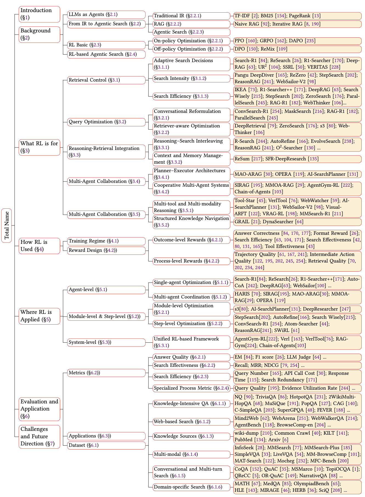
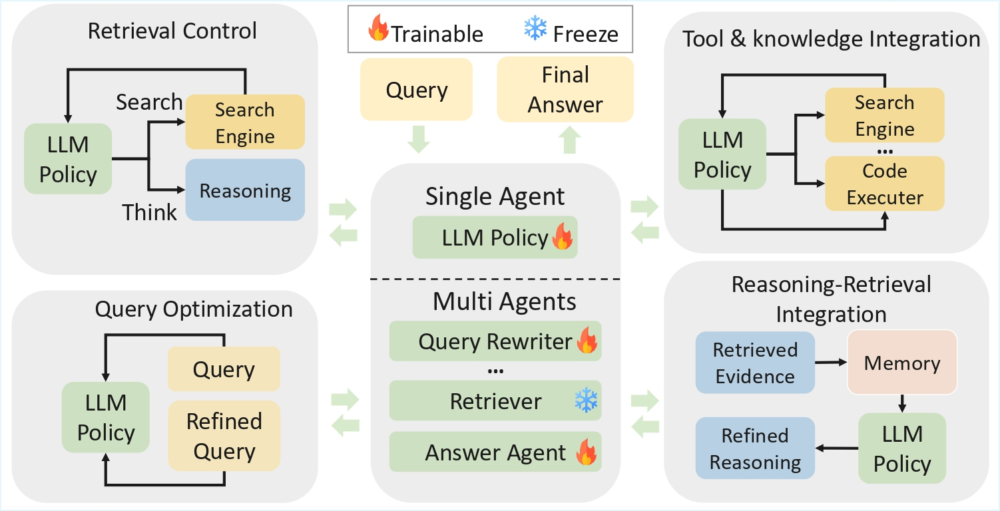

# Awesome RL-based Agentic Search Papers
This repository summarizes recent research on reinforcement‑learning (RL)‑based agentic search systems. These systems treat information‑seeking as a decision process: when a large language model (LLM) faces a complex question, it can plan and act by issuing search queries, revising those queries, and integrating evidence into its reasoning. RL techniques allow these agents to learn when to search, how intensively to search and how to integrate retrieved evidence into reasoning.

For more details, please check out our survey paper: [A Comprehensive Survey on Reinforcement Learning-based Agentic Search: Foundations, Roles, Optimizations, Evaluations, and Applications](https://arxiv.org/abs/2510.16724). If you find this repository helpful, please cite our survey paper.

```
@article{lin2025comprehensive,
  title={A Comprehensive Survey on Reinforcement Learning-based Agentic Search: Foundations, Roles, Optimizations, Evaluations, and Applications},
  author={Minhua Lin, Zongyu Wu, Zhichao Xu, Hui Liu, Xianfeng Tang, Qi He, Charu Aggarwal, Hui Liu, Xiang Zhang, Suhang Wang},
  journal={arXiv preprint arXiv:2510.16724},
  year={2025}
}
```

## Contents
* [Overview of RL-based Agentic Search](#overview-of-rl-based-agentic-search)
* [Illustrative Framework of RL-based Agentic Search](#illustrative-framework-of-rl-based-agentic-search)
* [Representative Survey](#representative-survey)
* [Method](#method)
* [Evaluation](#evaluation)

## Overview of RL-based Agentic Search


## Illustrative Framework of RL-based Agentic Search


## Representative Survey
| Time  | Paper Title | Venue |
| :---- | :----------- | :---- |
| 2025.10 | [A Comprehensive Survey on Reinforcement Learning-based Agentic Search: Foundations, Roles, Optimizations, Evaluations, and Applications](https://arxiv.org/abs/2510.16724) | *arXiv* |
| 2025.9 | [Reinforcement Learning Foundations for Deep Research Systems: A Survey](https://arxiv.org/abs/2509.06733) | *arXiv* |
| 2025.8 | [A Survey of LLM-based Deep Search Agents: Paradigm, Optimization, Evaluation, and Challenges](https://arxiv.org/abs/2508.05668) | *arXiv* |
| 2025.6 | [Reasoning RAG via System 1 or System 2: A Survey on Reasoning Agentic Retrieval-Augmented Generation for Industry Challenges](https://arxiv.org/abs/2506.10408) | *arXiv* |
| 2025.4 | [Synergizing RAG and Reasoning: A Systematic Review](https://arxiv.org/abs/2504.15909) | *arXiv* |
| 2025.1 | [Agentic Retrieval-Augmented Generation: A Survey on Agentic RAG](https://arxiv.org/abs/2501.09136) | *arXiv* |

---

## Method
### How RL is Used: Optimization Strategies
The below table summarizes representative works with corresponding optimization strategies. Specifically, ORM and PRM denote the Outcome Reward Model and the Process Reward Model, respectively. “Rule-based” indicates that the reward function is entirely computed from predefined rules; otherwise, an LLM is involved as a reward judge.
<details>
<summary>📊 Click to expand long table (scrollable). </summary>

<div style="overflow-x: auto; white-space: nowrap; font-size: 90%;">

| Method | RL Func. Role | Cold Start? | Training Env. | RL Alg. | Reward Type | Reward Func. | Opt. Scope | Dataset |
|---|---|---|---|---|---|---|---|---|
| [Search-R1](https://arxiv.org/abs/2503.09516) | Adapt-Search | ✗ | Real-world | PPO<br>GRPO | Rule-based ORM | Answer EM | Single-agent | [[NQ](https://aclanthology.org/Q19-1026/), [TriviaQA](https://arxiv.org/abs/1705.03551), [PopQA](https://arxiv.org/abs/2212.10511), [HotpotQA](https://arxiv.org/abs/1809.09600), [MuSiQue](https://arxiv.org/abs/2108.00573), [2WikiMultiHopQA](https://arxiv.org/abs/2011.01060), [Bamboogle](https://arxiv.org/abs/2210.03350)] |
| [ReSearch](https://arxiv.org/abs/2503.19470) | Adapt-Search | ✗ | Real-world | GRPO | Rule-based ORM | Format<br>Answer F1 | Single-agent | [[HotpotQA](https://arxiv.org/abs/1809.09600), [2WikiMultiHopQA](https://arxiv.org/abs/2011.01060), [MuSiQue](https://arxiv.org/abs/2108.00573), [Bamboogle](https://arxiv.org/abs/2210.03350)] |
| [AutoCoA](https://arxiv.org/abs/2504.18898) | Adapt-Search | ✓ | Real-world | GRPO | Rule-based ORM | Format<br>Answer EM | Single-agent | [[NQ](https://aclanthology.org/Q19-1026/), [TriviaQA](https://arxiv.org/abs/1705.03551), [PopQA](https://arxiv.org/abs/2212.10511), [HotpotQA](https://arxiv.org/abs/1809.09600), [MuSiQue](https://arxiv.org/abs/2108.00573), [2WikiMultiHopQA](https://arxiv.org/abs/2011.01060), [Bamboogle](https://arxiv.org/abs/2210.03350)] |
| [SimpleDeep-Searcher](https://arxiv.org/abs/2505.11894) | Adapt-Search | ✓ | Real-world | DPO<br>Reinforce++ | Rule-based ORM | Format<br>Answer F1 | Single-agent | [[HotpotQA](https://arxiv.org/abs/1809.09600), [2WikiMultiHopQA](https://arxiv.org/abs/2011.01060), [MuSiQue](https://arxiv.org/abs/2108.00573), [Multihop-rag](https://arxiv.org/abs/2401.15391), [FRAMES](https://aclanthology.org/2024.acl-long.716/), [Bamboogle](https://arxiv.org/abs/2210.03350), [GAIA](https://arxiv.org/abs/2311.12983), [BrowseComp-en](https://arxiv.org/abs/2411.08860), [BrowseComp-zh](https://arxiv.org/abs/2411.10013)] |
| [ExSearch](https://arxiv.org/abs/2504.15347) | Adapt-Search | ✗ | Real-world | GEM | PRM | Trajectory Quality | Single-agent | [[NQ](https://aclanthology.org/Q19-1026/), [HotpotQA](https://arxiv.org/abs/1809.09600), [MuSiQue](https://arxiv.org/abs/2108.00573)] |
| [IKEA](https://arxiv.org/abs/2505.11135) | Search Efficiency | ✗ | Real-world | GRPO | Rule-based ORM | Format<br>Answer EM<br>Knowledge-boundary | Step-level | [[NQ](https://aclanthology.org/Q19-1026/), [PopQA](https://arxiv.org/abs/2212.10511), [HotpotQA](https://arxiv.org/abs/1809.09600), [2WikiMultiHopQA](https://arxiv.org/abs/2011.01060)] |
| [R1-Searcher](https://arxiv.org/abs/2503.05592) | Adapt-Search | ✓ | Real-world | GRPO<br>Reinforce++ | Rule-based ORM | Format<br>Answer F1 | Single-agent | [[HotpotQA](https://arxiv.org/abs/1809.09600), [2WikiMultiHopQA](https://arxiv.org/abs/2011.01060), [Bamboogle](https://arxiv.org/abs/2210.03350), [MuSiQue](https://arxiv.org/abs/2108.00573)] |
| [R1-Searcher++](https://arxiv.org/abs/2505.17005) | Search Efficiency | ✓ | Real-world | GRPO<br>Reinforce++ | Rule-based ORM | Format<br>Answer EM<br>Std of Search Calls | Single-agent | [[HotpotQA](https://arxiv.org/abs/1809.09600), [2WikiMultiHopQA](https://arxiv.org/abs/2011.01060), [Bamboogle](https://arxiv.org/abs/2210.03350), [MuSiQue](https://arxiv.org/abs/2108.00573)] |
| [DeepRAG](https://arxiv.org/abs/2502.01142) | Adapt-Search<br>Search Efficiency | ✓ | Real-world | GRPO | Rule-based ORM | Answer EM<br>Retrieval Cost | Single-agent | [[HotpotQA](https://arxiv.org/abs/1809.09600), [2WikiMultiHopQA](https://arxiv.org/abs/2011.01060), [CAG](https://arxiv.org/abs/2401.08406), [PopQA](https://arxiv.org/abs/2212.10511), [WebQuestions](https://arxiv.org/abs/1309.5229), [MuSiQue](https://arxiv.org/abs/2108.00573)] |
| [UR²](https://arxiv.org/abs/2508.06165) | Adapt-Search | ✓ | Real-world<br>Curriculum | Reinforce++ | Rule-based ORM | Format<br>Answer EM<br>Fallback Penalty | Single-agent | [[MATH](https://arxiv.org/abs/2103.03874), Minerva, MedQA, MMLU-Pro, [HotpotQA](https://arxiv.org/abs/1809.09600), [Bamboogle](https://arxiv.org/abs/2210.03350), [2WikiMultiHopQA](https://arxiv.org/abs/2011.01060), [MuSiQue](https://arxiv.org/abs/2108.00573)] |
| [SSRL](https://arxiv.org/abs/2508.10874) | Adapt-Search | ✓ | Simulated<br>Self-Search | GRPO | Rule-based ORM | Format<br>Answer EM | Single-agent | [[NQ](https://aclanthology.org/Q19-1026/), [TriviaQA](https://arxiv.org/abs/1705.03551), [HotpotQA](https://arxiv.org/abs/1809.09600), [MuSiQue](https://arxiv.org/abs/2108.00573), [2WikiMultiHopQA](https://arxiv.org/abs/2011.01060), [Bamboogle](https://arxiv.org/abs/2210.03350)] |
| [Pangu DeepDiver](https://arxiv.org/abs/2505.24332) | Adapt-Search<br>Search Intensity | ✓ | Real-world | GRPO | Rule-based ORM | Format<br>Answer EM<br>Extra Search | Single-agent | [[Pangu](https://arxiv.org/abs/2505.24332), [Bamboogle](https://arxiv.org/abs/2210.03350), WebWalkerQA, [FRAMES](https://aclanthology.org/2024.acl-long.716/)] |
| [ReZero](https://arxiv.org/abs/2504.11001) | Search Intensity | ✗ | Real-world | GRPO | ORM+PRM | Format<br>Answer LLM-Judge<br>Retry | Step-level | [Apollo-3] |
| [StepSearch](https://arxiv.org/abs/2505.15107) | Adapt-Search<br>Search Intensity | ✗ | Real-world | PPO | Rule-based ORM+PRM | Format<br>Answer F1<br>Search Key<br>Information Gain<br>Redundancy Penalty | Step-level | [[HotpotQA](https://arxiv.org/abs/1809.09600), [MuSiQue](https://arxiv.org/abs/2108.00573), [2WikiMultiHopQA](https://arxiv.org/abs/2011.01060), [Bamboogle](https://arxiv.org/abs/2210.03350)] |
| [VERITAS](https://arxiv.org/abs/2505.19755) | Adapt-Search<br>R-Aware Opt. | ✗ | Real-world | PPO | ORM+PRM | Answer EM<br>Enhancing Faithfulness | Step-level | [[NQ](https://aclanthology.org/Q19-1026/), [TriviaQA](https://arxiv.org/abs/1705.03551), [PopQA](https://arxiv.org/abs/2212.10511), [HotpotQA](https://arxiv.org/abs/1809.09600), [MuSiQue](https://arxiv.org/abs/2108.00573), [2WikiMultiHopQA](https://arxiv.org/abs/2011.01060), [Bamboogle](https://arxiv.org/abs/2210.03350)] |
| [ReasonRAG](https://arxiv.org/abs/2505.09035) | Search Efficiency<br>R-S Inter. | ✗ | Real-world<br>MCTS | DPO | PRM | Shortest Path | Step-level | [[PopQA](https://arxiv.org/abs/2212.10511), [HotpotQA](https://arxiv.org/abs/1809.09600), [2WikiMultiHopQA](https://arxiv.org/abs/2011.01060), [Bamboogle](https://arxiv.org/abs/2210.03350), [MuSiQue](https://arxiv.org/abs/2108.00573)] |
| [Web-Sailor](https://arxiv.org/abs/2507.02592) | Adapt-Search<br>Ctx-Mem. | ✓ | Real-world | DUPO | ORM | Format<br>Answer F1 | Single-agent | [[li2025sailorfogqa](https://arxiv.org/abs/2507.02592), [BrowseComp-en](https://arxiv.org/abs/2411.08860), [BrowseComp-zh](https://arxiv.org/abs/2411.10013), [GAIA](https://arxiv.org/abs/2311.12983), [XBench](https://xbench.org/)] |
| [WebSailor-V2](https://arxiv.org/abs/2509.13305) | Multi-tool<br>Ctx-Mem. | ✓ | Real-world | GRPO | Rule-based ORM | Format<br>Answer F1 | Single-agent | [[li2025sailorfogqav2](https://arxiv.org/abs/2509.13305), [BrowseComp-en](https://arxiv.org/abs/2411.08860), [BrowseComp-zh](https://arxiv.org/abs/2411.10013), [GAIA](https://arxiv.org/abs/2311.12983), [XBench](https://xbench.org/), [HLE](https://arxiv.org/abs/2507.21201), [DeepResearchBench](https://arxiv.org/abs/2509.13362)] |
| [Search Wisely](https://arxiv.org/abs/2505.17281) | Search Efficiency | ✗ | Real-world | β-GRPO | Rule-based ORM | Confidence-based Answer EM | Single-agent | [[NQ](https://aclanthology.org/Q19-1026/), [HotpotQA](https://arxiv.org/abs/1809.09600), [TriviaQA](https://arxiv.org/abs/1705.03551), [2WikiMultiHopQA](https://arxiv.org/abs/2011.01060), [Bamboogle](https://arxiv.org/abs/2210.03350), [MuSiQue](https://arxiv.org/abs/2108.00573)] |
| [ZeroSearch](https://arxiv.org/abs/2505.04588) | Search Efficiency | ✓ | Simulated<br>Curriculum | PPO<br>GRPO<br>Reinforce | Rule-based ORM | Answer F1 | Single-agent | [[NQ](https://aclanthology.org/Q19-1026/), [TriviaQA](https://arxiv.org/abs/1705.03551), [PopQA](https://arxiv.org/abs/2212.10511), [HotpotQA](https://arxiv.org/abs/1809.09600), [2WikiMultiHopQA](https://arxiv.org/abs/2011.01060), [MuSiQue](https://arxiv.org/abs/2108.00573), [Bamboogle](https://arxiv.org/abs/2210.03350)] |
| [ParallelSearch](https://arxiv.org/abs/2508.09303) | Search Efficiency | ✓ | Real-world | GRPO | Rule-based ORM | Format<br>Answer EM<br>Query Decomopse<br>Search count | Single-agent | [[NQ](https://aclanthology.org/Q19-1026/), [TriviaQA](https://arxiv.org/abs/1705.03551), [PopQA](https://arxiv.org/abs/2212.10511), [HotpotQA](https://arxiv.org/abs/1809.09600), [2WikiMultiHopQA](https://arxiv.org/abs/2011.01060), [MuSiQue](https://arxiv.org/abs/2108.00573), [Bamboogle](https://arxiv.org/abs/2210.03350)] |
| [RAG-R1](https://arxiv.org/abs/2507.02962) | Search Efficiency<br>Conv-Reform. | ✓ | Real-world | PPO | ORM | Answer EM | Single-agent | [[NQ](https://aclanthology.org/Q19-1026/), [PopQA](https://arxiv.org/abs/2212.10511), [TriviaQA](https://arxiv.org/abs/1705.03551), [HotpotQA](https://arxiv.org/abs/1809.09600), [2WikiMultiHopQA](https://arxiv.org/abs/2011.01060), [MuSiQue](https://arxiv.org/abs/2108.00573), [Bamboogle](https://arxiv.org/abs/2210.03350)] |
| [ConvSearch-R1](https://arxiv.org/abs/2505.15776) | Conv-Reform. | ✓ | Real-world | GRPO | ORM | Format<br>Rank-Incentive | Step-level | [TopiOCQA], [QReCC] |
| [MaskSearch](https://arxiv.org/abs/2505.20285) | Conver. Reform.<br>R–S Inter. | ✓ | Real-world<br>Curriculum<br>RAMP | DAPO | Rule-based ORM | Format<br>Answer Recall<br>Length penalty | Single-agent | [[HotpotQA](https://arxiv.org/abs/1809.09600), FANOUTQA, [MuSiQue](https://arxiv.org/abs/2108.00573), [2WikiMultiHopQA](https://arxiv.org/abs/2011.01060), [Bamboogle](https://arxiv.org/abs/2210.03350), FreshQA] |
| [DeepRetrieval](https://arxiv.org/abs/2503.00223) | R-Aware Opt. | ✓ | Simulated | PPO | ORM | Format<br>Answer Recall | Single-level | [[NQ](https://aclanthology.org/Q19-1026/), [TriviaQA](https://arxiv.org/abs/1705.03551), SQuAD, FEVER, FactoidQA] |
| [WebThinker](https://arxiv.org/abs/2504.21776) | Search Efficiency | ✗ | Real-world | DPO | PRM | Answer EM<br>Tool Calls<br>Length penalty | Single-agent | [GPQA], [GAIA](https://arxiv.org/abs/2311.12983), WebWalkerQA, [HLE](https://arxiv.org/abs/2507.21201), [SuperGPQA](https://arxiv.org/abs/2504.02661), OpenThoughts, NaturalReasoning, NuminaMath |
| [s3](https://arxiv.org/abs/2505.14146) | R-Aware Opt. | ✓ | Simulated | PPO | Rule-based ORM | Gain Beyond RAG | Module-level | [[NQ](https://aclanthology.org/Q19-1026/), [TriviaQA](https://arxiv.org/abs/1705.03551), [PopQA](https://arxiv.org/abs/2212.10511), [HotpotQA](https://arxiv.org/abs/1809.09600), [2WikiMultiHopQA](https://arxiv.org/abs/2011.01060), [MuSiQue](https://arxiv.org/abs/2108.00573)] |
| [R-Search](https://arxiv.org/abs/2506.04185) | R–S Inter. | ✗ | Real-world | PPO<br>GRPO | Rule-based ORM+PRM | Format<br>Answer F1<br>Evidence Quality | Single-agent | [[HotpotQA](https://arxiv.org/abs/1809.09600), [2WikiMultiHopQA](https://arxiv.org/abs/2011.01060), [MuSiQue](https://arxiv.org/abs/2108.00573), [Bamboogle](https://arxiv.org/abs/2210.03350)] |
| [AutoRefine](https://arxiv.org/abs/2505.11277) | R–S Inter. | ✗ | Real-world | GRPO | ORM+PRM | Answer F1<br>Retrieval Reward | Step-level | [[NQ](https://aclanthology.org/Q19-1026/), [TriviaQA](https://arxiv.org/abs/1705.03551), [HotpotQA](https://arxiv.org/abs/1809.09600), [2WikiMultiHopQA](https://arxiv.org/abs/2011.01060), [MuSiQue](https://arxiv.org/abs/2108.00573), [Bamboogle](https://arxiv.org/abs/2210.03350), [PopQA](https://arxiv.org/abs/2212.10511)] |
| [EvolveSearch](https://arxiv.org/abs/2505.22501) | R–S Inter. | ✓ | Real-world<br>Self-evolving | GRPO | ORM | Format<br>Answer LLM-Judge | Single-agent | [[NQ](https://aclanthology.org/Q19-1026/), [TriviaQA](https://arxiv.org/abs/1705.03551), [HotpotQA](https://arxiv.org/abs/1809.09600), [2WikiMultiHopQA](https://arxiv.org/abs/2011.01060), [MuSiQue](https://arxiv.org/abs/2108.00573), [Bamboogle](https://arxiv.org/abs/2210.03350), [PopQA](https://arxiv.org/abs/2212.10511)] |
| [O²-Searcher](https://arxiv.org/abs/2505.16582) | R–S Inter. | ✓ | Simulated | GRPO | Rule-based ORM | Format<br>Diversity reward<br>Factual reward | Single-agent | [[NQ](https://aclanthology.org/Q19-1026/), [HotpotQA](https://arxiv.org/abs/1809.09600), [TriviaQA](https://arxiv.org/abs/1705.03551), [PopQA](https://arxiv.org/abs/2212.10511), [2WikiMultiHopQA](https://arxiv.org/abs/2011.01060), [MuSiQue](https://arxiv.org/abs/2108.00573), [Bamboogle](https://arxiv.org/abs/2210.03350)] |
| [Atom-Searcher](https://arxiv.org/abs/2508.12800) | R–S Inter. | ✓ | Real-world<br>Curriculum | GRPO | PRM+Rule-based ORM | Format<br>Answer F1<br>Atomic thought reward | Step-level | [[NQ](https://aclanthology.org/Q19-1026/), [TriviaQA](https://arxiv.org/abs/1705.03551), [HotpotQA](https://arxiv.org/abs/1809.09600), [2WikiMultiHopQA](https://arxiv.org/abs/2011.01060), [MuSiQue](https://arxiv.org/abs/2108.00573), [Bamboogle](https://arxiv.org/abs/2210.03350), [PopQA](https://arxiv.org/abs/2212.10511)] |
| [ReSum](https://arxiv.org/abs/2509.13313) | Ctx-Mem. | ✗ | Real-world | Resume-GRPO | ORM | Answer LLM-Judge | Single-agent | [[GAIA](https://arxiv.org/abs/2311.12983), [BrowseComp-en](https://arxiv.org/abs/2411.08860), [BrowseComp-zh](https://arxiv.org/abs/2411.10013), WebWalkerQA, [XBench](https://xbench.org/)] |
| [SFR-DeepResearch](https://arxiv.org/abs/2509.06283) | Ctx-Mem.<br>Multi-tool | ✗ | Real-world | REINFORCE | ORM | Answer LLM-Judge | Single-agent | [[FRAMES](https://aclanthology.org/2024.acl-long.716/), [GAIA](https://arxiv.org/abs/2311.12983), [HLE](https://arxiv.org/abs/2507.21201)] |
| [MAO-ARAG](https://arxiv.org/abs/2508.01005) | P–E Orches. | ✓ | Real-world | PPO | ORM | Format<br>Cost Penalty<br>Answer F1 | Multi-agent | [[NQ](https://aclanthology.org/Q19-1026/), [HotpotQA](https://arxiv.org/abs/1809.09600), [2WikiMultiHopQA](https://arxiv.org/abs/2011.01060), [MuSiQue](https://arxiv.org/abs/2108.00573), [Bamboogle](https://arxiv.org/abs/2210.03350), [PopQA](https://arxiv.org/abs/2212.10511), AmbigQA] |
| [OPERA](https://arxiv.org/abs/2508.16438) | P–E Orches. | ✓ | Real-world | MAPGRPO | PRM+ORM | Answerer Reward<br>Planer Reward<br>Rewriter Reward | Multi-agent | [[HotpotQA](https://arxiv.org/abs/1809.09600), [2WikiMultiHopQA](https://arxiv.org/abs/2011.01060), [MuSiQue](https://arxiv.org/abs/2108.00573), [NQ](https://aclanthology.org/Q19-1026/), [Multihop-rag](https://arxiv.org/abs/2401.15391)] |
| [AI-SearchPlanner](https://arxiv.org/abs/2508.20368) | P–E Orches. | ✗ | Real-world | PPO | ORM | Answer LLM-Judge<br>Trajectory Rationality | Module-level | [[NQ](https://aclanthology.org/Q19-1026/), [TriviaQA](https://arxiv.org/abs/1705.03551), [HotpotQA](https://arxiv.org/abs/1809.09600), [2WikiMultiHopQA](https://arxiv.org/abs/2011.01060), [MuSiQue](https://arxiv.org/abs/2108.00573), [Bamboogle](https://arxiv.org/abs/2210.03350), [PopQA](https://arxiv.org/abs/2212.10511)] |
| [SIRAG](https://arxiv.org/abs/2509.18167) | Cooperative Multi-Agent Systems | ✗ | Real-world | PPO | PRM | Process LLM-Judge | Multi-agent | [[2WikiMultiHopQA](https://arxiv.org/abs/2011.01060), [HotpotQA](https://arxiv.org/abs/1809.09600), [NQ](https://aclanthology.org/Q19-1026/), [PopQA](https://arxiv.org/abs/2212.10511)] |
| [MMOA-RAG](https://arxiv.org/abs/2501.15228) | Cooperative Multi-Agent Systems<br>R-aware Opt. | ✗ | Real-world | MA-PPO | Rule-based ORM | Answer F1<br>Efficiency penalty | Multi-agent | [[HotpotQA](https://arxiv.org/abs/1809.09600), [2WikiMultiHopQA](https://arxiv.org/abs/2011.01060), AmbigQA] |
| [Tool-Star](https://arxiv.org/abs/2505.16410) | Multi tool | ✓ | Real-world | REINFORCE++<br>GRPO<br>DPO | Rule-based ORM | Format<br>Answer EM | Single-agent | [LTMS, [MATH](https://arxiv.org/abs/2103.03874), GSM8K, WebWalkerQA, [HotpotQA](https://arxiv.org/abs/1809.09600), [2WikiMultiHopQA](https://arxiv.org/abs/2011.01060), [MuSiQue](https://arxiv.org/abs/2108.00573), [Bamboogle](https://arxiv.org/abs/2210.03350)] |
| [WebWatcher](https://arxiv.org/abs/2508.05748) | Multi tool<br>Multi-modal | ✓ | Real-world | GRPO | ORM | Format<br>Answer LLM-Judge | Single-agent | [[HLE](https://arxiv.org/abs/2507.21201), [Wu2025mm](https://arxiv.org/abs/2503.08495), LiveVQA, [MMSearch](https://arxiv.org/abs/2410.14922), [SimpleVQA](https://arxiv.org/abs/2505.20018)] |
| [Visual-ARFT](https://arxiv.org/abs/2505.14246) | Multi-modal<br>Multi-tool<br>Adapt-Search | ✓ | Real-world | GRPO | Rule-based ORM+PRM | Format<br>Answer F1<br>Query Semantic Sim. | Single-agent | [MATSearch] |
| [VRAG-RL](https://arxiv.org/abs/2505.22019) | Multi-modal<br>Search Efficiency | ✓ | Simulated | GRPO | ORM | Format<br>Answer LLM-Judge<br>Retrieval Efficiency | Single-agent | [SlideVQA, VidORAG, MMLongBench] |
| [MMSearch-R1](https://arxiv.org/abs/2506.20670) | Multi-modal<br>Search Efficiency | ✗ | Real-world | GRPO | Rule-based ORM | Format<br>Answer EM<br>Search Penalty | Single-agent | [[MMSearch](https://arxiv.org/abs/2506.20670), [Chen2023can](https://arxiv.org/abs/2305.00733), [MMSearch](https://arxiv.org/abs/2410.14922), [SimpleVQA](https://arxiv.org/abs/2505.20018), LiveVQA] |
| [GRAIL](https://arxiv.org/abs/2508.05498) | Adapt-Search<br>Struct-Nav. | ✓ | Real-world<br>Graph Env. | GRPO | PRM | Process LLM-Judge | Single-agent | [[WebQuestions](https://arxiv.org/abs/1309.5229), MetaQA, WebQSP] |
| [DynaSearcher](https://arxiv.org/abs/2507.17365) | Struct-Nav. | ✗ | Real-world<br>Graph Env.<br>KG+Doc Search | GRPO | Rule-based ORM | Format<br>Answer F1<br>Information Gain<br>Retrieval Penalty | Single-agent | [[HotpotQA](https://arxiv.org/abs/1809.09600), [2WikiMultiHopQA](https://arxiv.org/abs/2011.01060), [MuSiQue](https://arxiv.org/abs/2108.00573), [Bamboogle](https://arxiv.org/abs/2210.03350), [FRAMES](https://aclanthology.org/2024.acl-long.716/)] |
| [HARIS](https://arxiv.org/abs/2504.05779) | R-S Inter. | ✗ | Real-world | GRPO | Rule-based ORM | Format<br>Answer Accuracy<br>Decision Accuracy | Multi-agent | [M3, HoVer, CheckWhy] |
| [DeepNote](https://arxiv.org/abs/2504.04961) | Adapt-Search<br>Conv-Reform. | ✗ | Real-world | DPO | - | - | Single-agent | [[HotpotQA](https://arxiv.org/abs/1809.09600), [2WikiMultiHopQA](https://arxiv.org/abs/2011.01060), [MuSiQue](https://arxiv.org/abs/2108.00573), StrategyQA, ASQA] |
| [DeepResearcher](https://arxiv.org/abs/2504.03160) | Adapt-Search<br>Search Efficiency<br>Ctx-Mem. | ✗ | Real-world | GRPO | Rule-based ORM | Format<br>Answer F1 | Module-level | [[NQ](https://aclanthology.org/Q19-1026/), [TriviaQA](https://arxiv.org/abs/1705.03551), [HotpotQA](https://arxiv.org/abs/1809.09600), [2WikiMultiHopQA](https://arxiv.org/abs/2011.01060)] |
| [SWiRL](https://arxiv.org/abs/2502.15534) | Adapt-Search<br>R-S Inter. | ✓ | Real-world | PPO | PRM | Step LLM-Judge | Step-level | [[HotpotQA](https://arxiv.org/abs/1809.09600), [MuSiQue](https://arxiv.org/abs/2108.00573), CoFCA, GSM8K, Qasper] |
| [WebDancer](https://arxiv.org/abs/2507.16897) | Multi tool | ✓ | Real-world | DAPO | ORM | Answer EM | Single-agent | [[GAIA](https://arxiv.org/abs/2311.12983), WebWalkerQA, [BrowseComp-zh](https://arxiv.org/abs/2411.10013), [BrowseComp-en](https://arxiv.org/abs/2411.08860)] |
| [MedResearcher-R1](https://arxiv.org/abs/2508.14880) | Adpt-Search<br>Multi-Tool | ✓ | Real-world<br>Medical Tool | GRPO | ORM | Answer Acc<br>Response Quality<br>Efficiency penalty | Single-agent | [[XBench](https://xbench.org/), [GAIA](https://arxiv.org/abs/2311.12983), [MedBrowseComp](https://arxiv.org/abs/2508.15233)] |
| [Lucy](https://arxiv.org/abs/2505.11056) | Search Efficiency<br>R–S Inter. | ✓ | Real-world<br>SLMs | DAPO | Rule-based ORM | Format/XML validity<br>Answer EM<br>Tool exec. success<br>Visit/Search ratio<br>Efficient thinking | Single-agent | [WebWalkerQA] |
| [ASearcher](https://arxiv.org/abs/2508.07976) | R-S Inter.<br>Ctx-Mem.<br>Multi-tool | ✓ | Real-world<br>Browser Env.<br>Asynchronous | GRPO | ORM | Answer LLM-Judge | Single-agent | [[NQ](https://aclanthology.org/Q19-1026/), [TriviaQA](https://arxiv.org/abs/1705.03551), [PopQA](https://arxiv.org/abs/2212.10511), [HotpotQA](https://arxiv.org/abs/1809.09600), [2WikiMultiHopQA](https://arxiv.org/abs/2011.01060), [MuSiQue](https://arxiv.org/abs/2108.00573), [Bamboogle](https://arxiv.org/abs/2210.03350), [FRAMES](https://aclanthology.org/2024.acl-long.716/), [GAIA](https://arxiv.org/abs/2311.12983), [XBench](https://xbench.org/)] |
| [WebExplorer](https://arxiv.org/abs/2509.06501) | Ctx-Mem.<br>Conv-Reform. | ✓ | Real-world<br>Curriculum | GRPO | Rule-based ORM | Format<br>Answer EM | Single-agent | [[BrowseComp-zh](https://arxiv.org/abs/2411.10013), [BrowseComp-en](https://arxiv.org/abs/2411.08860), [GAIA](https://arxiv.org/abs/2311.12983), WebWalkerQA, [FRAMES](https://aclanthology.org/2024.acl-long.716/), [XBench](https://xbench.org/), [HLE](https://arxiv.org/abs/2507.21201)] |
| [WebResearcher](https://arxiv.org/abs/2509.13309) | Multi-tool | ✓ | Real-world<br>Curriculum | GSPO | Rule-based ORM | Answer EM | Single-agent | [[HLE](https://arxiv.org/abs/2507.21201), [GAIA](https://arxiv.org/abs/2311.12983), [BrowseComp-en](https://arxiv.org/abs/2411.08860), [BrowseComp-zh](https://arxiv.org/abs/2411.10013), [XBench](https://xbench.org/), [FRAMES](https://aclanthology.org/2024.acl-long.716/)] |
| [RECON](https://arxiv.org/abs/2510.10448) | Ctx-Mem. | ✓ | Real-world | PPO | Rule-based ORM | Answer EM | Single-agent | [[NQ](https://aclanthology.org/Q19-1026/), [TriviaQA](https://arxiv.org/abs/1705.03551), [Bamboogle](https://arxiv.org/abs/2210.03350), [HotpotQA](https://arxiv.org/abs/1809.09600), [2WikiMultiHopQA](https://arxiv.org/abs/2011.01060), [MuSiQue](https://arxiv.org/abs/2108.00573), [PopQA](https://arxiv.org/abs/2212.10511)] |
| [AgentGym-RL](https://arxiv.org/abs/2509.08755) | Cooperative Multi-Agent Systems<br>Multi tool | - | - | - | - | - | Unified RL Agentic Framework | - |
| [Chain-of-Agents](https://arxiv.org/abs/2508.13167) | Cooperative Multi-Agent Systems<br>Multi tool | - | - | - | - | - | Unified RL Agentic Framework | - |
| [Verl](https://github.com/volcengine/verl) | Multi tool | - | - | - | - | - | Unified RL Agentic Framework | - |
| [VerlTool](https://arxiv.org/abs/2509.01055) | Multi tool | - | - | - | - | - | Unified RL Agentic Framework | - |

</div>
</details>


### What RL is for: Functional Roles in Agentic Search

#### Retrieval Control
| Time | Paper Title | Role | Venue | Code |
| :---- | :----------- | :---- | :---- | :---- |
| 2025.11 | [Thinker: Training LLMs in Hierarchical Thinking for Deep Search via Multi-Turn Interaction](https://arxiv.org/abs/2511.07943) | Adaptive Search Decision; Search Intensity | *AAAI 2026* | [Code](https://github.com/OpenSPG/KAG-Thinker) |
| 2025.11 | [MemSearcher: Training LLMs to Reason, Search and Manage Memory via End-to-End Reinforcement Learning](https://arxiv.org/abs/2511.02805) | Adaptive Search Decision; Context & Memory Management | *arXiv* | [Code](https://github.com/icip-cas/MemSearcher) |
| 2025.09 | [DeepDive: Advancing Deep Search Agents with Knowledge Graphs and Multi-Turn RL](https://arxiv.org/abs/2509.10446) | Adaptive Search Decision; Search Efficiency; Structured Knowledge Navigation | *arXiv* | [Code](https://github.com/THUDM/DeepDive) |
| 2025.09 | [WebSailor‑V2: Bridging the Chasm to Proprietary Agents via Synthetic Data and Scalable Reinforcement Learning](https://arxiv.org/abs/2509.13305) | Multi‑Tool; Context & Memory Management | *arXiv* | [Code](https://github.com/Alibaba-NLP/DeepResearch) |
| 2025.08 | [MedResearcher‑R1: Expert‑Level Medical Deep Researcher via a Knowledge‑Informed Trajectory Synthesis Framework](https://arxiv.org/abs/2508.14880) | Adaptive Search Decision; Multi‑Tool | *arXiv* | [Code](https://github.com/AQ-MedAI/MedResearcher-R1) |
| 2025.08 | [ParallelSearch: Train Your LLMs to Decompose Query and Search Sub‑Queries in Parallel with Reinforcement Learning](https://arxiv.org/abs/2508.09303) | Search Efficiency | *arXiv* |  |
| 2025.08 | [SSRL: Self‑Search Reinforcement Learning](https://arxiv.org/abs/2508.10874) | Adaptive Search Decision | *arXiv* | [Code](https://github.com/TsinghuaC3I/SSRL) |
| 2025.08 | [UR²: Unify RAG and Reasoning through Reinforcement Learning](https://arxiv.org/abs/2508.06165) | Adaptive Search Decision | *arXiv* | [Code](https://github.com/Tsinghua-dhy/UR2) |
| 2025.07 | [RAG‑R1: Incentivize the Search and Reasoning Capabilities of LLMs through Multi‑Query Parallelism](https://arxiv.org/abs/2507.02962) | Search Efficiency; Convsational Reformulation | *arXiv* | [Code](https://github.com/inclusionAI/AgenticLearning/tree/main/RAG-R1) |
| 2025.05 | [Pangu DeepDiver: Adaptive Search Intensity Scaling via Open‑Web Reinforcement Learning](https://arxiv.org/abs/2505.24332) | Adaptive Search Decision; Search Intensity | *NeurIPS 2025 (Spotlight)* |  |
| 2025.05 | [Process vs. Outcome Reward: Which Is Better for Agentic RAG Reinforcement Learning](https://arxiv.org/abs/2505.14069) | Retriever‑Aware Optimization | *NeurIPS 2025* | [Code](https://github.com/Applied-Machine-Learning-Lab/ReasonRAG) |
| 2025.05 | [Search Wisely: Mitigating Sub‑Optimal Agentic Searches by Reducing Uncertainty](https://arxiv.org/abs/2505.17281) | Search Efficiency | *EMNLP 2025 (Main)* |  |
| 2025.05 | [StepSearch: Igniting LLMs’ Search Ability via Step‑Wise Proximal Policy Optimization](https://arxiv.org/abs/2505.15107) | Adaptive Search Decision; Search Intensity | *EMNLP 2025 (Main)* | [Code](https://github.com/Zillwang/StepSearch) |
| 2025.05 | [R1‑Searcher++: Incentivizing the Dynamic Knowledge Acquisition of LLMs via Reinforcement Learning](https://arxiv.org/abs/2505.17005) | Search Efficiency | *arXiv* | [Code](https://github.com/RUCAIBox/R1-Searcher-plus) |
| 2025.05 | [ZeroSearch: Incentivize the Search Capability of LLMs without Searching](https://arxiv.org/abs/2505.04588) | Search Efficiency | *arXiv* | [Code](https://github.com/Alibaba-NLP/ZeroSearch) |
| 2025.04 | [WebThinker: Empowering Large Reasoning Models with Deep Research Capability](https://arxiv.org/abs/2504.21776) | Search Efficiency | *NeurIPS 2025* | [Code](https://github.com/RUC-NLPIR/WebThinker) |
| 2025.04 | [ReZero: Enhancing LLM Search Ability by Trying One‑More‑Time](https://arxiv.org/abs/2504.11001) | Search Intensity | *arXiv* | [Code](https://github.com/menloresearch/ReZero) |
| 2025.04 | [DeepResearcher: Scaling Deep Research via Reinforcement Learning in Real‑World Environments](https://arxiv.org/abs/2504.03160) | Adaptive Search Decision; Search Efficiency; Context & Memory Management | *arXiv* | [Code](https://github.com/GAIR-NLP/DeepResearcher) |
| 2025.03 | [Learning to Reason with Search for LLMs via Reinforcement Learning](https://arxiv.org/abs/2503.19470) | Adaptive Search Decision | *NeurIPS 2025* |  |
| 2025.03 | [Search‑R1: Training LLMs to Reason and Leverage Search Engines with Reinforcement Learning](https://arxiv.org/abs/2503.09516) | Adaptive Search Decision | *COLM 2025* | [Code](https://github.com/PeterGriffinJin/Search-R1) |
| 2025.03 | [R1‑Searcher: Incentivizing the Search Capability in LLMs via Reinforcement Learning](https://arxiv.org/abs/2503.05592) | Adaptive Search Decision | *arXiv* | [Code](https://github.com/RUCAIBox/R1-Searcher) |
| 2025.02 | [DeepRAG: Thinking to Retrieval Step by Step for Large Language Models](https://arxiv.org/abs/2502.01142) | Adaptive Search Decision; Search Efficiency | *arXiv* |  |


#### Query Optimization
| Time | Paper Title | Role | Venue | Code |
| :---- | :----------- | :---- | :---- | :---- |
| 2025.11 | [CriticSearch: Fine‑Grained Credit Assignment for Search‑Based RAG with Reinforcement Learning](https://arxiv.org/abs/2511.12159) | Retriever‑Aware Optimization | *arXiv* |  |
| 2025.09 | [WebExplorer: Explore and Evolve for Training Long‑Horizon Web Agents](https://arxiv.org/abs/2509.06501) | Context & Memory Management; Convsational Reformulation | *arXiv* |  |
| 2025.08 | [OPERA: A Reinforcement Learning–Enhanced Orchestrated Planner‑Executor Architecture for Reasoning‑Oriented Multi‑Hop Retrieval](https://arxiv.org/abs/2508.16438) | Planner-Executor Orchestration | *arXiv* |  |
| 2025.08 | [ParallelSearch: Train Your LLMs to Decompose Query and Search Sub‑Queries in Parallel with Reinforcement Learning](https://arxiv.org/abs/2508.09303) | Search Efficiency | *arXiv* |  |
| 2025.07 | [RAG‑R1: Incentivize the Search and Reasoning Capabilities of LLMs through Multi‑Query Parallelism](https://arxiv.org/abs/2507.02962) | Search Efficiency; Convsational Reformulation | *arXiv* | [Code](https://github.com/inclusionAI/AgenticLearning/tree/main/RAG-R1) |
| 2025.05 | [ConvSearch‑R1: Enhancing Query Reformulation for Conversational Search with Reasoning via Reinforcement Learning](https://arxiv.org/abs/2505.15776) | Convsational Reformulation | *arXiv* |  |
| 2025.05 | [MaskSearch: A Universal Pre‑Training Framework to Enhance Agentic Search Capability](https://arxiv.org/abs/2505.20285) | Convsational Reformulation; Reasoning-Search Interaction | *arXiv* |  |
| 2025.05 | [s3: You Don’t Need That Much Data to Train a Search Agent via RL](https://arxiv.org/abs/2505.14146) | Retriever‑Aware Optimization | *EMNLP 2025 (Main)* | [code](https://github.com/pat-jj/s3) |
| 2025.05 | [ZeroSearch: Incentivize the Search Capability of LLMs without Searching](https://arxiv.org/abs/2505.04588) | Search Efficiency | *arXiv* | [Code](https://github.com/Alibaba-NLP/ZeroSearch) |
| 2025.04 | [WebThinker: Empowering Large Reasoning Models with Deep Research Capability](https://arxiv.org/abs/2504.21776) | Search Efficiency | *NeurIPS 2025* | [Code](https://github.com/RUC-NLPIR/WebThinker) |
| 2025.03 | [DeepRetrieval: Hacking Real Search Engines and Retrievers with Large Language Models via Reinforcement Learning](https://arxiv.org/abs/2503.00223) | Retriever‑Aware Optimization | *arXiv* | [Code](https://github.com/pat-jj/DeepRetrieval) |
| 2025.01 | [Improving Retrieval‑Augmented Generation through Multi‑Agent Reinforcement Learning](https://arxiv.org/abs/2501.15228) | Cooperative Multi-Agent Systems | *NeurIPS 2025* | [Code](https://github.com/chenyiqun/MMOA-RAG) |
| 2024.10 | [Retriever-and-Memory: Towards Adaptive Note-Enhanced Retrieval-Augmented Generation](https://arxiv.org/abs/2410.08821) | Conversational Reformulation; Context & Memory Management | *EMNLP 2025 (Findings)* |  |

#### Reasoning–Retrieval Integration
| Time | Paper Title | Role | Venue | Code |
| :---- | :----------- | :---- | :---- | :---- |
| 2025.10 | [GlobalRAG: Enhancing Global Reasoning in Multi-hop Question Answering via Reinforcement Learning](https://arxiv.org/abs/2510.20548) | Reasoning-Search Interaction; Retriever‑Aware Optimization | *arXiv* | [Code](https://github.com/CarnegieBin/GlobalRAG) |
| 2025.10 | [RECON: Reasoning with Condensation for Efficient Retrieval‑Augmented Generation](https://arxiv.org/abs/2510.10448) | Context & Memory Management | *arXiv* |  |
| 2025.10 | [Search Self-play: Pushing the Frontier of Agent Capability without Supervision](https://arxiv.org/abs/2510.18821) | Adaptive Search Decision; Self-Play Training | *arXiv* | [Code](https://github.com/Alibaba-Quark/SSP) |
| 2025.09 | [ReSum: Unlocking Long‑Horizon Search Intelligence via Context Summarization](https://arxiv.org/abs/2509.13313) | Context & Memory Management | *arXiv* |  |
| 2025.09 | [SFR‑DeepResearch: Towards Effective Reinforcement Learning for Autonomously Reasoning Single Agents](https://arxiv.org/abs/2509.06283) | Context & Memory Management; Multi‑Tool | *arXiv* |  |
| 2025.08 | [Atom‑Searcher: Enhancing Agentic Deep Research via Fine‑Grained Atomic Thought Reward](https://arxiv.org/abs/2508.12800) | Reasoning-Search Interaction | *arXiv* | [Code](https://github.com/antgroup/Research-Venus/tree/main/Atom_Searcher) |
| 2025.08 | [Beyond Ten Turns: Unlocking Long‑Horizon Agentic Search with Large‑Scale Asynchronous RL](https://arxiv.org/abs/2508.07976) | Reasoning-Search Interaction; Retriever‑Aware Optimization | *arXiv* |  |
| 2025.07 | [DynaSearcher: Dynamic Knowledge Graph Augmented Search Agent via Multi‑Reward Reinforcement Learning](https://arxiv.org/abs/2507.17365) | Structured Knowledge Navigation | *arXiv* |  |
| 2025.07 | [WebSailor: Navigating Super‑Human Reasoning for Web Agents](https://arxiv.org/abs/2507.02592) | Adaptive Search Decision; Context & Memory Management | *arXiv* |  |
| 2025.06 | [R‑Search: Empowering LLM Reasoning with Search via Multi‑Reward Reinforcement Learning](https://arxiv.org/abs/2506.04185) | Reasoning-Search Interaction | *arXiv* |  |
| 2025.05 | [Search and Refine During Think: Autonomous Retrieval‑Augmented Reasoning of LLMs](https://arxiv.org/abs/2505.11277) | Reasoning-Search Interaction | *NeurIPS 2025* | [Code](https://github.com/syr-cn/AutoRefine) |
| 2025.05 | [EvolveSearch: An Iterative Self‑Evolving Search Agent](https://arxiv.org/abs/2505.22501) | Reasoning-Search Interaction | *arXiv* |  |
| 2025.05 | [O²‑Searcher: A Searching‑Based Agent Model for Open‑Domain Open‑Ended Question Answering](https://arxiv.org/abs/2505.16582) | Reasoning-Search Interaction | *arXiv* | [Code](https://github.com/RUC-GSAI/O2-Searcher) |
| 2025.05 | [Process vs. Outcome Reward: Which Is Better for Agentic RAG Reinforcement Learning](https://arxiv.org/abs/2505.14069) | Reasoning‑Search Interaction; Retriever‑Aware Optimization | *arXiv* |  |
| 2025.04 | [DeepResearcher: Scaling Deep Research via Reinforcement Learning in Real‑World Environments](https://arxiv.org/abs/2504.03160) | Context & Memory Management | *arXiv* |  |
| 2025.04 | [Synthetic Data Generation & Multi‑Step Reinforcement Learning for Reasoning & Tool Use](https://arxiv.org/abs/2504.04736) | Reasoning‑Search Interaction | *arXiv* |  |

#### Multi‑Agent Collaboration
| Time | Paper Title | Role | Venue | Code |
| :---- | :----------- | :---- | :---- | :---- |
| 2025.09 | [AgentGym‑RL: Training LLM Agents for Long‑Horizon Decision Making through Multi‑Turn Reinforcement Learning](https://arxiv.org/abs/2509.08755) | Cooperative Multi-Agent Systems; Multi‑Tool | *arXiv* |  |
| 2025.09 | [SIRAG: Towards Stable and Interpretable RAG with a Process‑Supervised Multi‑Agent Framework](https://arxiv.org/abs/2509.18167) | Cooperative Multi-Agent Systems | *arXiv* |  |
| 2025.09 | [WebExplorer: Explore and Evolve for Training Long‑Horizon Web Agents](https://arxiv.org/abs/2509.06501) | Context & Memory Management; Convsational Reformulation | *arXiv* |  |
| 2025.08 | [AI‑SearchPlanner: Modular Agentic Search via Pareto‑Optimal Multi‑Objective Reinforcement Learning](https://arxiv.org/abs/2508.20368) | Planner-Executor Orchestration | *arXiv* |  |
| 2025.08 | [Chain‑of‑Agents: End‑to‑End Agent Foundation Models via Multi‑Agent Distillation and Agentic RL](https://arxiv.org/abs/2508.13167) | Cooperative Multi-Agent Systems; Multi‑Tool | *arXiv* |  |
| 2025.08 | [MAO‑ARAG: Multi‑Agent Orchestration for Adaptive Retrieval‑Augmented Generation](https://arxiv.org/abs/2508.01005) | Planner-Executor Orchestration | *arXiv* |  |
| 2025.08 | [OPERA: A Reinforcement Learning–Enhanced Orchestrated Planner‑Executor Architecture for Reasoning‑Oriented Multi‑Hop Retrieval](https://arxiv.org/abs/2508.16438) | Planner-Executor Orchestration | *arXiv* |  |
| 2025.05 | [Advancing Multi-Agent RAG Systems with Minimalist Reinforcement Learning](https://arxiv.org/abs/2505.17086) | Cooperative Multi-Agent Systems | *arXiv* |  |
| 2025.01 | [Improving Retrieval‑Augmented Generation through Multi‑Agent Reinforcement Learning](https://arxiv.org/abs/2501.15228) | Cooperative Multi-Agent Systems | *arXiv* |  |

#### Tool and Knowledge Integration
| Time | Paper Title | Role | Venue | Code |
| :---- | :----------- | :---- | :---- | :---- |
| 2025.11 | [Agent‑R1: Training Powerful LLM Agents with End‑to‑End Reinforcement Learning](https://arxiv.org/abs/2511.14460) | Multi‑Tool | *arXiv* | [Code (community)](https://github.com/0russwest0/Agent-R1) |
| 2025.09 | [Empowering LLM Tool Invocation with Tool-call Reward Model](https://openreview.net/forum?id=LnBEASInVr) | Multi‑Tool | *ICLR 2026 Submission* |  |
| 2025.09 | [VerlTool: Towards Holistic Agentic Reinforcement Learning with Tool Use](https://arxiv.org/abs/2509.01055) | Multi‑Tool | *arXiv* | [Code](https://github.com/TIGER-AI-Lab/verl-tool) |
| 2025.09 | [WebResearcher: Unleashing unbounded reasoning capability in Long‑Horizon Agents](https://arxiv.org/abs/2509.13309) | Multi‑Tool | *arXiv* | [Code](https://github.com/Alibaba-NLP/DeepResearch) |
| 2025.08 | [GRAIL: Learning to Interact with Large Knowledge Graphs for Retrieval‑Augmented Reasoning](https://arxiv.org/abs/2508.05498) | Adaptive Search Decision; Structured Knowledge Navigation | *arXiv* | [Code](https://github.com/Changgeww/GRAIL) |
| 2025.08 | [MedResearcher‑R1: Expert‑Level Medical Deep Researcher via a Knowledge‑Informed Trajectory Synthesis Framework](https://arxiv.org/abs/2508.14880) | Adaptive Search Decision; Multi‑Tool | *arXiv* | [Code](https://github.com/AQ-MedAI/MedResearcher-R1) |
| 2025.08 | [WebWatcher: Breaking New Frontier of Vision‑Language Deep Research Agent](https://arxiv.org/abs/2508.05748) | Multi‑Tool; Multi‑Modal | *arXiv* |  |
| 2025.07 | [DynaSearcher: Dynamic Knowledge Graph Augmented Search Agent via Multi‑Reward Reinforcement Learning](https://arxiv.org/abs/2507.17365) | Structured Knowledge Navigation | *arXiv* |  |
| 2025.06 | [MMSearch‑R1: Incentivizing LMMs to Search](https://arxiv.org/abs/2506.20670) | Multi‑Modal; Search Efficiency | *arXiv* | [Code](https://github.com/EvolvingLMMs-Lab/multimodal-search-r1) |
| 2025.05 | [VRAG‑RL: Empower Vision‑Perception‑Based RAG for Visually Rich Information Understanding via Iterative Reasoning with RL](https://arxiv.org/abs/2505.22019) | Multi‑Modal; Search Efficiency | *arXiv* |  |
| 2025.05 | [Tool‑Star: Empowering LLM‑Brained Multi‑Tool Reasoner via Reinforcement Learning](https://arxiv.org/abs/2505.16410) | Multi‑Tool | *arXiv* | [Code](https://github.com/dongguanting/Tool-Star) |
| 2025.05 | [Visual Agentic Reinforcement Fine‑Tuning](https://arxiv.org/abs/2505.14246) | Multi‑Modal; Multi‑Tool; Adaptive Search Decision | *arXiv* | [Code](https://github.com/Liuziyu77/Visual-RFT/tree/main/Visual-ARFT) |

### Where RL is Applied: Optimization Scopes

#### Agent-level
<details>
<summary>📊 Click to expand long table (scrollable). </summary>

<div style="overflow-x: auto; white-space: nowrap; font-size: 90%;">

| Time | Paper Title | Role | Venue | Code |
| :---- | :----------- | :---- | :---- | :---- |
| 2025.11 | [Thinker: Training LLMs in Hierarchical Thinking for Deep Search via Multi-Turn Interaction](https://arxiv.org/abs/2511.07943) | Single-agent Optimization | *AAAI 2026* | [Code](https://github.com/OpenSPG/KAG-Thinker) |
| 2025.11 | [MemSearcher: Training LLMs to Reason, Search and Manage Memory via End-to-End Reinforcement Learning](https://arxiv.org/abs/2511.02805) | Single-agent Optimization | *arXiv* | [Code](https://github.com/icip-cas/MemSearcher) |
| 2025.09 | [DeepDive: Advancing Deep Search Agents with Knowledge Graphs and Multi-Turn RL](https://arxiv.org/abs/2509.10446) | Single-agent Optimization | *arXiv* | [Code](https://github.com/THUDM/DeepDive) |
| 2025.09 | [SFR-DeepResearch: Towards Effective Reinforcement Learning for Autonomously Reasoning Single Agents](https://arxiv.org/abs/2509.06283) | Single-agent Optimization | *arXiv* |  |
| 2025.09 | [WebExplorer: Explore and evolve for training long-horizon web agents](https://arxiv.org/abs/2509.06501) | Single-agent Optimization | *arXiv* |  |
| 2025.09 | [WebResearcher: Unleashing unbounded reasoning capability in Long-Horizon Agents](https://arxiv.org/abs/2509.13309) | Single-agent Optimization | *arXiv* |  |
| 2025.09 | [AgentGym-RL: Training LLM Agents for Long-Horizon Decision Making through Multi-Turn Reinforcement Learning](https://arxiv.org/abs/2509.08755) | Single-agent Optimization | *arXiv* |  |
| 2025.09 | [WebSailor-v2: bridging the chasm to proprietary agents via synthetic data and scalable reinforcement learning](https://arxiv.org/abs/2509.13305) | Single-agent Optimization | *arXiv* | [Code](https://github.com/Alibaba-NLP/DeepResearch) |
| 2025.08 | [MMSearch-r1: Incentivizing lmms to search](https://arxiv.org/abs/2506.20670) | Single-agent Optimization | *arXiv* | [Code](https://github.com/EvolvingLMMs-Lab/multimodal-search-r1) |
| 2025.08 | [MedResearcher-r1: expert-level medical deep researcher via a knowledge-informed trajectory synthesis framework](https://arxiv.org/abs/2508.14880) | Single-agent Optimization | *arXiv* | [Code](https://github.com/AQ-MedAI/MedResearcher-R1) |
| 2025.08 | [Webwatcher: Breaking new frontier of vision-language deep research agent](https://arxiv.org/abs/2508.05748) | Single-agent Optimization | *arXiv* |  |
| 2025.08 | [GRAIL: Learning to interact with large knowledge graphs for retrieval-augmented reasoning](https://arxiv.org/abs/2508.05498) | Single-agent Optimization | *arXiv* | [Code](https://github.com/Changgeww/GRAIL) |
| 2025.08 | [VRAG-RL: Empower vision-perception-based rag for visually rich information understanding via iterative reasoning with rl](https://arxiv.org/abs/2505.22019) | Single-agent Optimization | *arXiv* |  |
| 2025.08 | [Visual Agentic Reinforcement Fine-Tuning](https://arxiv.org/abs/2505.14246) | Single-agent Optimization | *arXiv* | [Code](https://github.com/Liuziyu77/Visual-RFT/tree/main/Visual-ARFT) |
| 2025.08 | [WebSailor: navigating super-human reasoning for web agents](https://arxiv.org/abs/2507.02592) | Single-agent Optimization | *arXiv* |  |
| 2025.08 | [ParallelSearch: Train your LLMs to Decompose Query and Search Sub-queries in Parallel with Reinforcement Learning](https://arxiv.org/abs/2508.09303) | Single-agent Optimization | *arXiv* |  |
| 2025.08 | [UR2: Unify RAG and Reasoning through Reinforcement Learning](https://arxiv.org/abs/2508.06165) | Single-agent Optimization | *arXiv* | [Code](https://github.com/Tsinghua-dhy/UR2) |
| 2025.08 | [SSRL: Self-Search Reinforcement Learning](https://arxiv.org/abs/2508.10874) | Single-agent Optimization | *arXiv* | [Code](https://github.com/TsinghuaC3I/SSRL) |
| 2025.08 | [DynaSearcher: Dynamic Knowledge Graph Augmented Search Agent via Multi-Reward Reinforcement Learning](https://arxiv.org/abs/2507.17365) | Single-agent Optimization | *arXiv* |  |
| 2025.07 | [R-Search: empowering llm reasoning with search via multi-reward reinforcement learning](https://arxiv.org/abs/2506.04185) | Single-agent Optimization | *arXiv* |  |
| 2025.07 | [EvolveSearch: an iterative self-evolving search agent](https://arxiv.org/abs/2505.22501) | Single-agent Optimization | *arXiv* |  |
| 2025.07 | [O2-Searcher: a searching-based agent model for open-domain open-ended question answering](https://arxiv.org/abs/2505.16582) | Single-agent Optimization | *arXiv* | [Code](https://github.com/RUC-GSAI/O2-Searcher) |
| 2025.07 | [Pangu DeepDiver: adaptive search intensity scaling via open-web reinforcement learning](https://arxiv.org/abs/2505.24332) | Single-agent Optimization | *NeurIPS 2025 (Spotlight)* |  |
| 2025.07 | [IKEA: Reinforced agentic knowledge boundary by efficient searching](https://arxiv.org/abs/2505.08738) | Single-agent Optimization | *arXiv* |  |
| 2025.07 | [ZeroSearch: Incentivize the search capability of llms without searching](https://arxiv.org/abs/2505.04588) | Single-agent Optimization | *arXiv* | [Code](https://github.com/Alibaba-NLP/ZeroSearch) |
| 2025.07 | [MaskSearch: A Universal Pre-Training Framework to Enhance Agentic Search Capability](https://arxiv.org/abs/2505.20285) | Single-agent Optimization | *arXiv* |  |
| 2025.07 | [ReZero: Enhancing LLM Search Ability by Trying One-More-Time](https://arxiv.org/abs/2504.11001) | Single-agent Optimization | *arXiv* | [Code](https://github.com/menloresearch/ReZero) |
| 2025.07 | [Tool-Star: Empowering llm-brained multi-tool reasoner via reinforcement learning](https://arxiv.org/abs/2505.16410) | Single-agent Optimization | *arXiv* | [Code](https://github.com/dongguanting/Tool-Star) |
| 2025.07 | [DeepRetrieval: Hacking Real Search Engines and Retrievers with Large Language Models via Reinforcement Learning](https://arxiv.org/abs/2503.00223) | Single-agent Optimization | *arXiv* |  |
| 2025.07 | [WebThinker: Empowering Large Reasoning Models with Deep Research Capability](https://arxiv.org/abs/2504.21776) | Single-agent Optimization | *NeurIPS 2025* | [Code](https://github.com/RUC-NLPIR/WebThinker) |
| 2025.05 | [Search Wisely: Mitigating Sub-optimal Agentic Searches By Reducing Uncertainty](https://arxiv.org/abs/2505.17281) | Single-agent Optimization | *EMNLP 2025 (Main)* |  |
| 2025.05 | [DeepResearcher: Scaling deep research via reinforcement learning in real-world environments](https://arxiv.org/abs/2504.03160) | Single-agent Optimization | *arXiv* | [Code](https://github.com/GAIR-NLP/DeepResearcher) |
| 2025.05 | [Search-r1: Training llms to reason and leverage search engines with reinforcement learning](https://arxiv.org/abs/2503.09516) | Single-agent Optimization | *COLM 2025* | [Code](https://github.com/PeterGriffinJin/Search-R1) |
| 2025.05 | [ReSearch: learning to reason with search for llms via reinforcement learning](https://arxiv.org/abs/2503.19470) | Single-agent Optimization | *arXiv* |  |
| 2025.05 | [R1-Searcher++: Incentivizing the dynamic knowledge acquisition of llms via reinforcement learning](https://arxiv.org/abs/2505.17005) | Single-agent Optimization | *arXiv* | [Code](https://github.com/RUCAIBox/R1-Searcher-plus) |
| 2025.05 | [AutoCoA: advancing end-to-end deep search agents via hierarchical reinforcement learning](https://arxiv.org/abs/2503.07255) | Single-agent Optimization | *arXiv* |  |
| 2025.05 | [Lucys: a compact reinforcement-learning based deep research web agent](https://arxiv.org/abs/2505.06690) | Single-agent Optimization | *arXiv* |  |
| 2025.04 | [DeepRAG: Thinking to retrieval step by step for large language models](https://arxiv.org/abs/2502.01142) | Single-agent Optimization | *arXiv* |  |
| 2025.03 | [StepSearch: Igniting LLMs Search Ability via Step-Wise Proximal Policy Optimization](https://arxiv.org/abs/2505.15107) | Single-agent Optimization | *EMNLP 2025 (Main)* | [Code](https://github.com/Zillwang/StepSearch) |
| 2025.03 | [Improving Retrieval-Augmented Generation through Multi-Agent Reinforcement Learning](https://arxiv.org/abs/2501.15228) | Multi-agent Coordination | *arXiv* |  |
| 2025.03 | [Haris: Coordinating large language models for answering complex questions with search](https://arxiv.org/abs/2504.06332) | Multi-agent Coordination | *arXiv* |  |
| 2025.03 | [SIRAG: Towards stable and interpretable RAG with a process-supervised multi-agent framework](https://arxiv.org/abs/2509.18167) | Multi-agent Coordination | *arXiv* |  |
| 2025.03 | [MAO-ARAG: multi-agent orchestration for adaptive retrieval-augmented generation](https://arxiv.org/abs/2508.01005) | Multi-agent Coordination | *arXiv* |  |
| 2025.03 | [MMOA-RAG: Improving retrieval-augmented generation through multi-agent reinforcement learning](https://arxiv.org/abs/2501.15228) | Multi-agent Coordination | *arXiv* |  |
| 2025.03 | [OPERA: A Reinforcement Learning-enhanced Orchestrated Planner-Executor Architecture for Reasoning-oriented Multi-hop Retrieval](https://arxiv.org/abs/2508.16438) | Multi-agent Coordination | *arXiv* |  |
| 2025.02 | [DeepRAG: Thinking to Retrieval Step by Step for Large Language Models](https://arxiv.org/abs/2502.01142) | Single‑agent Optimization | *arXiv* |  |
| 2025.01 | [Improving Retrieval‑Augmented Generation through Multi‑Agent Reinforcement Learning](https://arxiv.org/abs/2501.15228) | Multi‑agent Coordination | *arXiv* |  |
| 2024.10 | [Retriever-and-Memory: Towards Adaptive Note-Enhanced Retrieval-Augmented Generation](https://arxiv.org/abs/2410.08821) | Single‑agent Optimization | *arXiv* |  |
</div>
</details>

#### Step-level
<details>
<summary>📊 Click to expand long table (scrollable). </summary>

<div style="overflow-x: auto; white-space: nowrap; font-size: 90%;">

| Time | Paper Title | Role | Venue | Code |
| :---- | :----------- | :---- | :---- | :---- |
| 2025.08 | [Beyond Correctness: Rewarding Faithful Reasoning in Retrieval‑Augmented Generation](https://arxiv.org/abs/2508.17556) | Step‑level Optimization | *arXiv* |  |
| 2025.08 | [Atom‑Searcher: Enhancing Agentic Deep Research via Fine‑Grained Atomic Thought Reward](https://arxiv.org/abs/2508.12800) | Step‑level Optimization | *arXiv* |  |
| 2025.05 | [StepSearch: Igniting LLMs’ Search Ability via Step‑Wise Proximal Policy Optimization](https://arxiv.org/abs/2505.15107) | Step‑level Optimization | *EMNLP 2025* |  |
| 2025.05 | [Process vs. Outcome Reward: Which Is Better for Agentic RAG Reinforcement Learning](https://arxiv.org/abs/2505.14069) | Step‑level Optimization | *arXiv* |  |
| 2025.05 | [Search and Refine During Think: Autonomous Retrieval‑Augmented Reasoning of LLMs](https://arxiv.org/abs/2505.11277) | Step‑level Optimization | *arXiv* |  |
| 2025.05 | [ConvSearch‑R1: Enhancing Query Reformulation for Conversational Search with Reasoning via Reinforcement Learning](https://arxiv.org/abs/2505.15776) | Step‑level Optimization | *arXiv* |  |
| 2025.05 | [Reinforced Internal‑External Knowledge Synergistic Reasoning for Efficient Adaptive Search Agent](https://arxiv.org/abs/2505.07596) | Step‑level Optimization | *arXiv* |  |
| 2025.04 | [ReZero: Enhancing LLM Search Ability by Trying One‑More‑Time](https://arxiv.org/abs/2504.11001) | Step‑level Optimization | *arXiv* | [Code](https://github.com/menloresearch/ReZero) |
| 2025.04 | [Synthetic Data Generation & Multi‑Step Reinforcement Learning for Reasoning & Tool Use](https://arxiv.org/abs/2504.04736) | Step‑level Optimization | *arXiv* |  |
</div>
</details>

#### Module-level
<details>
<summary>📊 Click to expand long table (scrollable). </summary>

<div style="overflow-x: auto; white-space: nowrap; font-size: 90%;">

| Time | Paper Title | Role | Venue | Code |
| :---- | :----------- | :---- | :---- | :---- |
| 2025.08 | [AI-SearchPlanner: Modular Agentic Search via Pareto-Optimal Multi-Objective Reinforcement Learning](https://arxiv.org/abs/2508.20368) | Module-level Optimization | *arXiv* |  |
| 2025.05 | [s3: You Don’t Need That Much Data to Train a Search Agent via RL](https://arxiv.org/abs/2505.14146) | Module-level Optimization | *arXiv* |  |
| 2025.04 | [Deepresearcher: Scaling deep research via reinforcement learning in real-world environments](https://arxiv.org/abs/2504.03160) | Module-level Optimization | *arXiv* | [Code](https://github.com/GAIR-NLP/DeepResearcher) |
</div>
</details>

#### System-level
<details>
<summary>📊 Click to expand long table (scrollable). </summary>

<div style="overflow-x: auto; white-space: nowrap; font-size: 90%;">
  
| Time | Paper Title | Role | Venue | Code |
| :---- | :----------- | :---- | :---- | :---- |
| 2025.09 | [AgentGym‑RL: Training LLM Agents for Long‑Horizon Decision Making through Multi‑Turn Reinforcement Learning](https://arxiv.org/abs/2509.08755) | Unified RL‑based Agentic Framework | *arXiv* |  |
| 2025.09 | [VerlTool: Towards Holistic Agentic Reinforcement Learning with Tool Use](https://arxiv.org/abs/2509.01055) | Unified RL‑based Agentic Framework | *arXiv* |  |
| 2025.08 | [Chain‑of‑Agents: End‑to‑End Agent Foundation Models via Multi‑Agent Distillation and Agentic RL](https://arxiv.org/abs/2508.13167) | Unified RL‑based Agentic Framework | *arXiv* |  |
| 2025.02 | [RAG‑Gym: Systematic Optimization of RAG under Partial Observability](https://arxiv.org/abs/2502.13957) | Unified RL‑based Agentic Framework | *arXiv* |  |
| 2024.09 | [HybridFlow: A Flexible and Efficient RLHF Framework](https://arxiv.org/abs/2409.19256) | Unified RL‑based Agentic Framework (Verl) | *arXiv* |  |
</div>
</details>

## Evaluation
### Metrics
Below is a compact checklist of commonly used evaluation signals for RL-based agentic search (see the survey for details):

- **Answer quality (final output)**: Exact Match (EM), token-level F1, and *LLM-as-a-judge* scores for open-ended outputs (e.g., used by [Search-R1](https://arxiv.org/abs/2503.09516), [ReZero](https://arxiv.org/abs/2504.11001)).  
  - Similarity-based metrics (e.g., [BERTScore](https://arxiv.org/abs/1904.09675)) are also used for more free-form generations.
- **Search effectiveness (retrieval / evidence)**: retrieval relevance/coverage metrics (e.g., Recall@k / Precision@k / nDCG) and evidence usefulness; some works explicitly optimize or evaluate retrieval behavior (e.g., [DeepRetrieval](https://arxiv.org/abs/2503.00223)).
- **Search efficiency (cost / budget)**: number of search/tool calls, token/latency cost, and other explicit penalties/rewards (e.g., [Pangu DeepDiver](https://arxiv.org/abs/2505.24332), [MAO-ARAG](https://arxiv.org/abs/2508.01005), [R1-Searcher++](https://arxiv.org/abs/2505.17005)).
- **Process / trajectory quality (intermediate steps)**: step-wise correctness, information gain, redundancy penalties, and other process-level signals (often combined with a PRM or heuristic shaping; e.g., [StepSearch](https://arxiv.org/abs/2505.15107), [VERITAS](https://arxiv.org/abs/2505.19755), [ReasonRAG](https://arxiv.org/abs/2505.09035), [ConvSearch-R1](https://arxiv.org/abs/2505.15776)).
- **System-level benchmarks**: some benchmarks are designed specifically to evaluate deep-research style agents (e.g., [RAG-Gym](https://arxiv.org/abs/2502.13957)).


### Datasets
<!-- The survey groups evaluation datasets by the knowledge source and interaction setting:

<details>
<summary>📚 Click to expand dataset taxonomy table (from the survey). </summary> -->

| Category | Datasets |
|---|---|
| Knowledge Source | [BEIR](https://arxiv.org/abs/2104.08663), [MS MARCO](https://arxiv.org/abs/1611.09268), [MDR](https://arxiv.org/abs/2011.09641), [Wikipedia](https://dumps.wikimedia.org/), [S2ORC](https://aclanthology.org/2020.acl-main.447/), [Common Crawl](https://commoncrawl.org/), [PubMed](https://pubmed.ncbi.nlm.nih.gov/), [S2AG](https://www.semanticscholar.org/paper/S2AG%3A-A-Semantic-Scholar-API-for-AI-and-Weld/d8f7ce0bced8448b585cdf7537f9c1633e2f3f46) |
| Knowledge-Intensive QA | [NQ](https://aclanthology.org/Q19-1026/), [TriviaQA](https://arxiv.org/abs/1705.03551), [HotpotQA](https://arxiv.org/abs/1809.09600), [MuSiQue](https://arxiv.org/abs/2108.00573), [2WikiMultiHopQA](https://arxiv.org/abs/2011.01060), [PopQA](https://arxiv.org/abs/2212.10511), [StrategyQA](https://arxiv.org/abs/1909.09534), [FEVER](https://aclanthology.org/N18-1074/)<br>[ARC](https://arxiv.org/abs/1803.05457), [MedQA](https://aclanthology.org/2021.naacl-main.366/), [MATH](https://arxiv.org/abs/2103.03874), [GSM8K](https://arxiv.org/abs/2110.14168), [MMLU](https://arxiv.org/abs/2009.03300), [MMLU-Pro](https://arxiv.org/abs/2406.01574), [GPQA](https://arxiv.org/abs/2311.12983), [SuperGPQA](https://arxiv.org/abs/2504.02661), [OpenThoughts](https://arxiv.org/abs/2501.16022), [NaturalReasoning](https://arxiv.org/abs/2405.15955), [NuminaMath](https://arxiv.org/abs/2406.14856), [CAG](https://arxiv.org/abs/2401.08406), [RAG-Gym](https://arxiv.org/abs/2502.13957) |
| Web-based Search | [WebQuestions](https://arxiv.org/abs/1309.5229), [WebWalkerQA](https://arxiv.org/abs/2501.07572), [Bamboogle](https://arxiv.org/abs/2210.03350), [BrowseComp-en](https://arxiv.org/abs/2411.08860), [BrowseComp-zh](https://arxiv.org/abs/2411.10013), [GAIA](https://arxiv.org/abs/2311.12983), [GAIA-2](https://arxiv.org/abs/2507.21201), [FreshQA](https://arxiv.org/abs/2402.02875)<br>[ASQA](https://arxiv.org/abs/2204.06092), [HLE](https://arxiv.org/abs/2507.21201), [XBench](https://xbench.org/), [WebRAG](https://arxiv.org/abs/2411.11588), [DeepResearchBench](https://arxiv.org/abs/2509.13362), [MedBrowseComp](https://arxiv.org/abs/2508.15233) |
| Multi-modal | [InfoSeek](https://arxiv.org/abs/2401.06490), [MMSearch](https://arxiv.org/abs/2410.14922), [SimpleVQA](https://arxiv.org/abs/2505.20018), [LiveVQA](https://arxiv.org/abs/2504.03214), [SlideVQA](https://arxiv.org/abs/2305.03393), [VidORAG](https://arxiv.org/abs/2503.06235), [MMLongBench](https://arxiv.org/abs/2403.19959), [MATSearch](https://arxiv.org/abs/2505.14246) |
| Conversational | [TopiOCQA](https://aclanthology.org/2022.emnlp-main.381/), [QReCC](https://arxiv.org/abs/2005.11509), [CoQA](https://arxiv.org/abs/1808.07042), [QuAC](https://arxiv.org/abs/1808.07036), [AmbigQA](https://arxiv.org/abs/2004.10645) |
| Domain-specific | [MedQA](https://aclanthology.org/2021.naacl-main.366/), [PubMedQA](https://aclanthology.org/D19-1259/), [BioASQ](http://bioasq.org/), [MATH](https://arxiv.org/abs/2103.03874), [GSM8K](https://arxiv.org/abs/2110.14168), [FinQA](https://arxiv.org/abs/2109.00122), [SciQA](https://arxiv.org/abs/2306.10958), [MedBrowseComp](https://arxiv.org/abs/2508.15233) |

<!-- </details> -->


